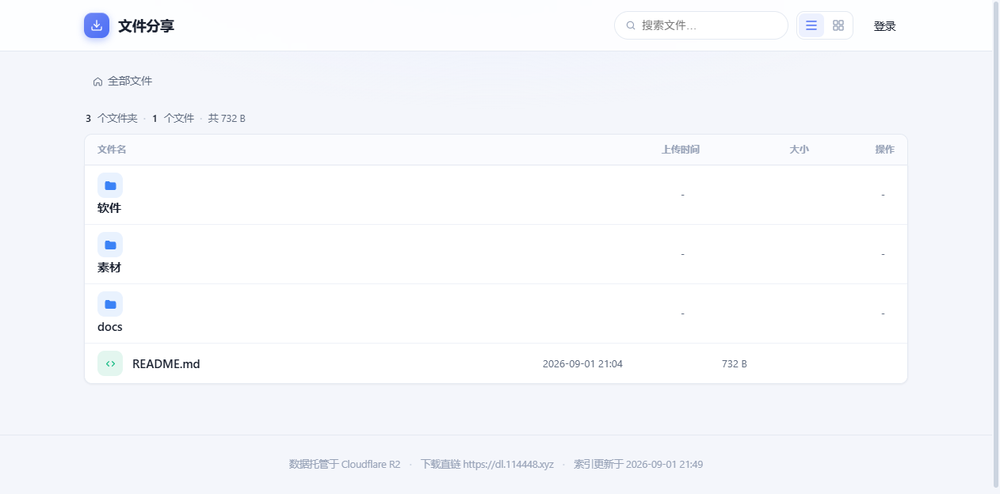
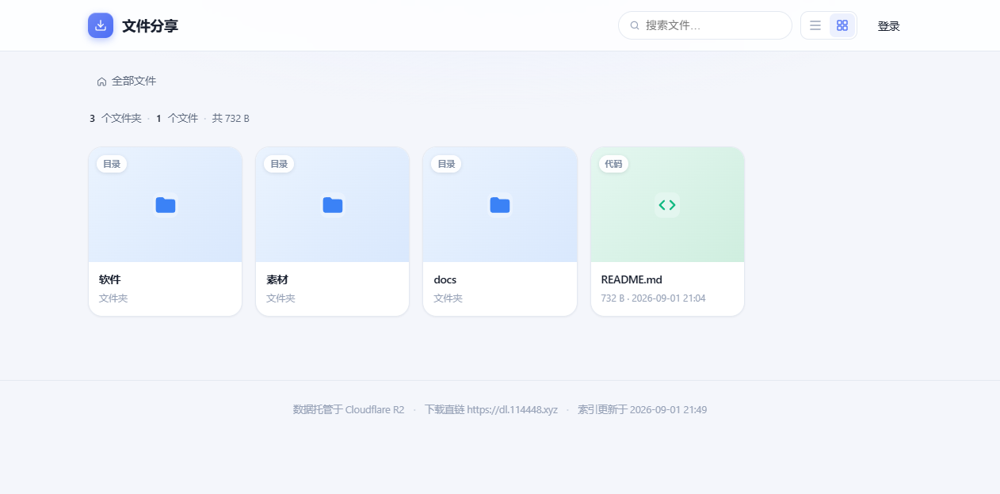
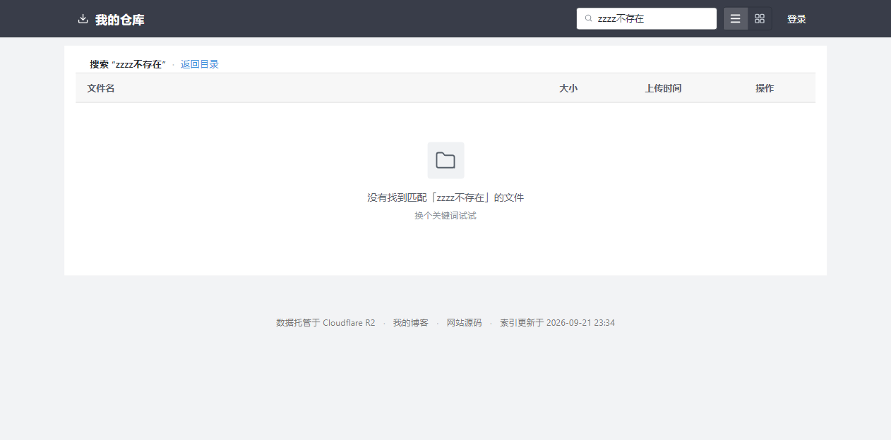

# r2share

基于 Cloudflare Worker + R2 的零费用个人仓库（我的仓库）。

单文件 < 95 MiB、总量 < 10GB、全部公开、以分享下载为主的场景下，**月成本严格为 $0**。

---

## 界面预览

未登录列表视图（默认）：


未登录网格视图（右上角切换；单元格底部操作栏 hover 时浮出）：


登录后顶部多出「重建索引 / 新建目录 / 上传 / 退出」四个按钮，每行出现删除按钮，
并展开上传拖拽区（列表视图的删除按钮常显，不依赖 hover）：


Markdown / 文本预览弹层（标题栏右侧「下载」按钮直链下载）：


搜索无结果时的空态（与「目录为空」文案分开）：


---

## 架构

```
浏览器
 ├─ 打开目录页   ──→ Worker 渲染 HTML（1 次请求；style.css/app.js 由 CF 边缘直接服务，0 次 Worker）
 │                      └─ fetch R2 上的 files.json（1 次 Class B 读）
 ├─ 下载文件     ──→ R2 公开桶直链 <你的下载域>（出口永远免费，不经过 Worker）
 └─ 上传 N 个文件 ─→ Worker /api/sign（1 次请求，批量签发）
                     → 浏览器并发 PUT 同源 /api/local-put（每文件 1 次请求，Worker 内部写 R2）
                     → Worker /api/commit（1 次请求，批量写索引）
                     （N > 400 时前端自动按 400 一批分片，sign / commit 各调用多次；
                       原因见下文「已知限制」）
```

默认上传走 **Worker 代理**（`UPLOAD_VIA_WORKER = "1"`）：浏览器的 PUT 指向本 Worker
的同源路径，由 Worker 用 R2 binding 写入，**不依赖 `r2.cloudflarestorage.com` 直传**——
该端点在某些网络（如国内）被墙，presigned 直传会 `ERR_ADDRESS_UNREACHABLE`。
代价是上传数据流经 Worker 且上限受 Workers 请求体限制（见 `MAX_UPLOAD`）。

三条通道里，**下载完全不经过 Worker**；浏览只有首页 HTML 消耗 1 次 Worker 请求
（静态资源由 CF 边缘直接服务，免费且无上限）。这是能做到零费用且抗刷的关键。

如切换回 presigned 直传（设 `UPLOAD_VIA_WORKER = "0"`），上传明细见下表的
「presigned 直传」备注：浏览器直传 R2 S3 端点，绕过 Workers 请求体上限，
但要求网络能直连 `r2.cloudflarestorage.com`。

### 请求消耗

| 动作 | Workers 请求 | R2 操作 | 费用 |
| --- | --- | --- | --- |
| 浏览目录页 | 1（渲染 HTML） | 1 × Class B（读 files.json） | $0 |
| 下载文件 | 0（公开桶直链） | 1 × Class B | $0 |
| 上传 1 个文件（Worker 代理） | 3（sign + PUT + commit） | 1 Class A put + 1 Class B head + 1 Class B 读 files.json + 1 Class A 写 | $0 |
| 批量上传 N 个文件（Worker 代理） | N + 2（1 × sign + N × PUT + 1 × commit） | N Class A put + N Class B head + 1 Class B 读 + 1 Class A 写 | $0 |
| 批量删除 N 个文件 | 1 | N Class A delete + 1 Class B 读 + 1 Class A 写 | $0 |

> **批量优先**：上传与删除都走 `entries[]` / `paths[]` 批量形态。拖入 200 个文件时
> Worker 请求是 202 次（而非 600 次），索引读写从 200 次降到 1 次 —— 索引读改写
> 是整条链路里最贵的一环，批量化把它摊薄成常数。

> presigned 直传备注：单个文件 2 次 Worker 请求（sign + commit），数据不经过 Worker，
> 上限为 5 GiB（R2 单对象）。Worker 代理模式上限为 Workers 请求体（见 `MAX_UPLOAD`）。

### 免费额度边界（超出才收费）

| 额度 | 免费上限 | 超出单价 |
| --- | --- | --- |
| R2 存储 | 10 GB | $0.015/GB-月 |
| Workers 请求 | 10 万/天 | 需升级 $5/月套餐 |
| R2 Class A（写 / list） | 100 万/月 | $4.50/百万 |
| R2 Class B（读） | 1000 万/月 | $0.36/百万 |
| 出口流量 | **永久免费** | — |

### 索引并发：条件写（CAS）

`files.json` 的每一次写入都收敛到 `src/store.ts` 的 `mutateIndex()`：
**读 → 改 → 带 etag 的条件写**，条件不满足（说明读出来之后被别的 isolate 改过）
就重读、重放、重试，最多 6 次。

为什么必须这么做：模块级 promise 锁只在**单个 isolate 内**有效，而 Cloudflare 会因
负载或版本更新同时跑多个 isolate。多端/多请求并发写索引时，两边各自「读 → 改 → 写」，
后写的会把先写的整个盖掉——表现为**索引里凭空少几条**（文件在桶里，列表里没有）。

两条硬约束，改 `mutate*` 回调时务必遵守：

1. **`mutate` 必须是纯内存变换**——内部不得 `await` 任何存储操作。删对象、遍历桶这类
   一次性副作用必须先做完，再把结果带进回调。
2. **`mutate` 必须可重放且幂等**——冲突时会拿最新索引重新执行一次，重复执行不能产生叠加效果。
3. **无变化就别写**——回调返回 `dirty: false` 时不会发起写入。`upsertFiles` 逐字段
   （`p` / `s` / `t` / `c`）比对，完全一致才算「无变化」：重复建同名目录、重试一次其实
   已经成功的 `commit`，都不该白触发一次「读索引 + 写索引」，也不该平白制造一次 CAS
   争用（多端并发时它正是 409 的来源之一）。代价是**调用方必须给出稳定的 `t`**
   （`/api/commit` 用 `obj.uploaded`、`/api/mkdir` 用占位对象自己的 `uploaded`），
   否则 `t` 每次都不一样，这条优化永远不生效。

---

## 部署（推荐：GitHub 一键安装）

**Fork → 配好 Secrets → push `main`，完事。** 仓库内置 `.github/workflows/deploy.yml`：
push 到 `main` 就自动 `wrangler deploy`，并把 GitHub Secrets 当作权威来源同步到
Cloudflare Worker secrets。

### 域名为什么必须部署时才注入

域名**因人而异**，绝不能写死在仓库里——否则别人 fork 后会带着作者的域名上线，
下载直链直接指向作者的 R2 桶。所以本仓库把域名做成**部署时注入的必填项**：

> 叫 Secret 还是 Variable 不影响机制，关键是**它不落仓库**。本仓库推荐放 Variables
> （明文可见、随时能改），放 Secrets 也照常工作。

```
wrangler.toml（模板：域名/桶名处是合法默认值，不含任何人的真实域名）
        ＋  GitHub Variables / Secrets（WORKER_DOMAIN / DL_DOMAIN）
        ↓   scripts/gen-config.mjs（部署前自动执行，缺项即 exit 1）
wrangler.deploy.toml（真正部署用的配置；已 gitignore，不落仓库）
```

> **为什么不能直接在 `wrangler.toml` 里引用 Secret**：wrangler 不支持在配置里插值
> 环境变量，`custom_domain` 路由又是结构化字段，只能由脚本生成。于是「域名必填、
> 不填就部署失败」就落在 `gen-config` 上——**没配 WORKER_DOMAIN / DL_DOMAIN 就生成
> 不出配置，部署直接中止**。仓库里 `wrangler.toml` 只放默认值，从根上 fork-safe。

### 需要配置什么：2 个必填 Variable + 2 个必填 Secret

在仓库 **Settings → Secrets and variables → Actions** 里配置。**域名、桶名这类「配置」
放 Variables 页，真正的密钥放 Secrets 页**——这样必填项只有 4 个，其余全部可留空。

#### Variables 页（非敏感，明文可见，推荐放这里）

| Variable | 必填 | 用途 | 怎么填 |
| --- | --- | --- | --- |
| `WORKER_DOMAIN` | ✅ | **站点入口域** | 形如 `file.example.com`，**不带 `https://`、不带路径**。必须是你 CF 账户下的域名/子域，否则 `custom_domain` 绑定会因 "zone not found" 部署失败 |
| `DL_DOMAIN` | ✅ | **R2 下载直链域**（公开桶绑定的自定义域） | 形如 `dl.example.com`，或 `<id>.r2.dev`（官方限流，不推荐生产）。同样不带 `https://` |
| `CLOUDFLARE_ACCOUNT_ID` | 选填 | 账户 id（32 位十六进制） | CF 控制台右上角。只关联一个账户时通常可留空（wrangler 会从 API Token 推断）；若报 `More than one account available` 就把它填上 |
| `BUCKET_NAME` | 选填 | R2 桶名 | 默认 `r2share`。若改，需同步改桶名与 CORS 应用时的桶名 |
| `SITE_NAME` | 选填 | 站点名称（页面标题与页头） | 默认 `我的仓库` |

> 域名不是密码，放 Variables 而不是 Secrets 的好处：**随时能看见、能改**，
> 不用「重新输入一遍才看得到」。两类都支持——同名同时配了会优先读 Variables。

#### Secrets 页（敏感，加密存储）

| Secret | 必填 | 用途 | 怎么拿 |
| --- | --- | --- | --- |
| `CLOUDFLARE_API_TOKEN` | ✅ | 部署认证（wrangler 用它登录 CF） | CF 控制台 → 右上角头像 → **我的个人资料 → API 令牌 → 创建令牌**。需含 **Workers Scripts Edit** 和 **R2** 权限，形如 `cfut_xxxx` |
| `ADMIN_PASSWORD` | ✅ | 网盘管理口令（登录用） | 自己想一个，建议 8 位以上 |
| `SESSION_SECRET` | 选填 | 会话签名密钥（cookie 用 HMAC-SHA256 加签） | `openssl rand -hex 32`。**留空则自动从 `ADMIN_PASSWORD` 派生**——便利，但代价见下方「`SESSION_SECRET` 留空的代价」，公网部署建议配上 |
| `R2_ACCESS_KEY_ID` | 选填 | R2 S3 API 令牌 | **只有关闭 Worker 中转（`UPLOAD_VIA_WORKER=0`）走 presigned 直传时才需要**。默认 `=1` 的上传走 Worker 中转，完全不碰 S3，这三项都不用配 |
| `R2_SECRET_ACCESS_KEY` | 选填 | 同一令牌的 Secret Key | 创建令牌时**只显示一次**，立即复制保存 |
| `R2_ACCOUNT_ID` | 选填 | S3 端点用的账户 id | 走 Actions 部署时留空会自动取 `CLOUDFLARE_ACCOUNT_ID` 的值同步到 Worker；**手动部署没有这层同步，需自行填**（两者本来就是同一个账户 id） |

**一句话**：想最快跑起来，只需要填 `WORKER_DOMAIN`、`DL_DOMAIN`、`CLOUDFLARE_API_TOKEN`、
`ADMIN_PASSWORD` 这 4 个。

> ⚠️ Secrets 页那几项的 workflow 行为：**GitHub 是权威来源**，每次部署用 GitHub 里的值
> **覆盖** CF 端同名 secret。
> - 想改密钥：**先在 GitHub 改**，再 push 或手动重跑 workflow，不要只改 CF 控制台（会被覆盖回去）
> - 某项留空（值为空）：workflow **跳过同步**，保留 CF 端现有值，不会误清空
> - `ADMIN_PASSWORD` 缺失：**部署会在前置校验里直接失败**，避免「部署成功但谁也登录
>   不进去」这种静默故障
> - `SESSION_SECRET` 留空 → Worker 端从 `ADMIN_PASSWORD` 确定性派生会话密钥（少配一个）
> - `R2_ACCOUNT_ID` 留空 → 取 `CLOUDFLARE_ACCOUNT_ID` 的值同步（见上一节说明）
>
> ⚠️ **隐私**：Secrets 的值只会在 Actions 运行时注入，**不要写进 README 或任何仓库文件**——仓库是公开的，写进去等于公开密钥。（Variables 是明文，别把密钥放那里。）

#### `SESSION_SECRET` 留空的代价

不配 `SESSION_SECRET` 时，会话签名密钥 = `SHA-256("r2share/session-key/v1:" + ADMIN_PASSWORD)`。
于是**任何拿到一个有效 cookie 的人，都能离线枚举口令**：cookie 的 payload 是明文
base64 的过期时间，签名是 `HMAC(密钥, payload)`——两边都已知，只剩口令是未知量，
本地跑字典即可验证猜测，不受登录接口的限流约束。

口令足够强时不构成实际威胁（能拿到 cookie 的人本来也已登录）；但配置一个独立的
随机串可以**彻底消除这条路径**，顺带让「改口令」不再踢掉自己的会话：

```bash
openssl rand -hex 32   # 填进 SESSION_SECRET
```

> 📌 **不再需要 `KV_ID`**。登录失败计数已从 KV 改为 Worker 模块内的内存 Map
> （原因见「已知限制 · 登录限流」），`wrangler.toml` 里已无任何 KV 绑定，
> 仓库里也不再需要 `.deploy.local.json` 这一层配置转发。

### 手动触发

除 push 外，仓库 **Actions → Deploy r2share → Run workflow** 可随时手动跑一次
（比如只改了 GitHub Secrets 想立即生效）。

---

## 手动部署（不用 GitHub Actions）

不想用 CI 也行，思路一致：**本地提供域名 → 生成配置 → deploy**。域名取值优先级
是环境变量 > `.dev.vars`。

### 0. 部署前自检

```bash
npx wrangler login   # 浏览器授权（或用 CLOUDFLARE_API_TOKEN 环境变量）
npm run gen-config   # 先生成 wrangler.deploy.toml（读 WORKER_DOMAIN / DL_DOMAIN）
npm run check
```

`check` 校验的是生成后的 `wrangler.deploy.toml`（+ `cors.deploy.json`）：**是否已生成
部署配置**（没生成直接阻断——模板只有默认值，拿它去部署等于对默认桶名与空域名上线）、
**两处桶名是否一致**（`[[r2_buckets]] bucket_name` 决定绑定的桶，`[vars] BUCKET_NAME`
是 presigned 签名用的桶名，不一致会把文件签到另一个桶）、是否绑了自定义域、`MAX_UPLOAD`
是否顶到账户请求体上限、是否残留已废弃的 `[[kv_namespaces]]`。有问题直接退出码 1。
`npm run deploy` 内部会自动跑这两步。

### 1. 创建 R2 桶

```bash
npx wrangler r2 bucket create r2share
```

### 2. 开启公开访问并绑定自定义域

在 Cloudflare 控制台 → R2 → 你的桶 → Settings：

- **Public access** 选 `Allow`，会得到一个 `r2.dev` 域名
- 在 **Custom Domains** 里绑定你的下载域（即 `DL_DOMAIN`，如 `dl.<你的域名>`）

> ⚠️ 必须用自定义域。`r2.dev` 官方明确限流、不推荐生产使用。

### 配置与隐私边界

| 内容 | 放哪 | 是否进仓库 |
| --- | --- | --- |
| 管理口令、会话密钥 | `wrangler secret`（生产）/ `.dev.vars`（本地） | ❌ |
| R2 S3 API 密钥（**仅**关闭 Worker 中转走直传时才需要） | 同上 | ❌ |
| Worker 域名、下载域名、桶名、站点名 | GitHub **Variables**（或 Secrets）→ `gen-config` 注入 → 生成的 `wrangler.deploy.toml` | ❌（生成物已 gitignore） |
| 模板 `wrangler.toml` / `cors.json` 的结构 | 仓库 | ✅（只有合法默认值，不含任何人的真实域名） |

### 3. 设置密钥

必须的只有管理口令：

```bash
npx wrangler secret put ADMIN_PASSWORD      # 管理口令
```

以下都可留空，按需再配：

```bash
npx wrangler secret put SESSION_SECRET      # 选填：留空则由 ADMIN_PASSWORD 派生会话密钥（代价见上文）
npx wrangler secret put R2_ACCESS_KEY_ID    # 选填：仅当 UPLOAD_VIA_WORKER=0 走 presigned 直传时才需要
npx wrangler secret put R2_SECRET_ACCESS_KEY
npx wrangler secret put R2_ACCOUNT_ID       # 走直传时必填，值同 CLOUDFLARE_ACCOUNT_ID
```

> **为什么 R2 S3 凭证是选填的**：默认 `UPLOAD_VIA_WORKER = "1"`，上传由 Worker 内部
> `env.BUCKET.put()` 直接写入，不经过 S3 API，因此完全不需要 API 令牌。
> R2 的 S3 API 令牌在控制台 R2 概览页右侧「Manage R2 API Tokens」创建，权限选
> Object Read & Write——**只有**你要关掉 Worker 中转、改走浏览器直传时才需要它。

### 4. 提供域名并生成配置

**不要**直接编辑 `wrangler.toml`（它是模板：改它等于把域名写进公开仓库，而且部署读的是
`gen-config` 生成的配置，直接改模板不会生效）。把域名交给 `gen-config`，二选一：

写进 `.dev.vars`（推荐；`.dev.vars` 已 gitignore，参考 `.dev.vars.example`）：

```
WORKER_DOMAIN=file.<你的域名>
DL_DOMAIN=dl.<你的域名>
# 选填
# BUCKET_NAME=r2share
# SITE_NAME=我的仓库
```

或临时用环境变量：

```bash
WORKER_DOMAIN=file.<你的域名> DL_DOMAIN=dl.<你的域名> npm run gen-config
```

生成 `wrangler.deploy.toml`（+ `cors.deploy.json`）。

### 5. 首次部署

```bash
npm run deploy   # = gen-config → check → wrangler deploy --config wrangler.deploy.toml
```

### 6. 配置 CORS（仅 presigned 直传需要，CI 会自动做）

默认上传走 Worker 代理（同源 PUT `/api/local-put`），**用不到 CORS**。只有把
`UPLOAD_VIA_WORKER` 改成 `0` 改用 presigned 直传时，浏览器才会跨域 PUT，需要在桶上放行：

```bash
npx wrangler r2 bucket cors set r2share --file cors.deploy.json
```

`cors.deploy.json` 由 `gen-config` 生成，origin 已按 `WORKER_DOMAIN` 填好。

> **GitHub Actions 一键部署不用手动跑这步**：流水线最后一步 `Apply bucket CORS` 会读
> 生成的 `wrangler.deploy.toml` 判断上传模式——默认的代理模式直接跳过，
> 只有直传模式（`UPLOAD_VIA_WORKER` ≠ `1`）才自动应用。手动 `wrangler` 部署才需要自己执行。

> ⚠️ 无论模板还是生成物都必须用**新版嵌套格式**：`{"rules":[{"allowed":{"origins":[],"methods":[],"headers":[]}}]}`。
> 允许的请求头字段是 `allowed` 对象内的 **`headers`**（不是外层 `allowedHeaders`——
> 字段名/层级错误会被 R2 API 静默忽略，导致浏览器跨域预检失败、上传卡死）。
> 其余字段驼峰命名（`exposeHeaders` / `maxAgeSeconds`）。
> 旧版裸数组 / PascalCase 格式（`AllowedOrigins`）会让 R2 API 报 `code 10040 "JSON not well formed"`。

### 7. Worker 自定义域由 WORKER_DOMAIN 自动绑定

`gen-config` 会按 `WORKER_DOMAIN` 生成 `[[routes]] pattern = "<你的域名>" custom_domain = true`，
Cloudflare 自动创建 DNS 记录与证书，所有路径直达 Worker，无需在 DNS 控制台做任何操作。

> ⚠️ 模板刻意不用 `zone_name` 传统路由 + 手动 A 记录：在 assets 模式下传统路由会被
> 当作 assets 路径匹配（部署警告 "Will match assets: public\<pattern>"），且手动加的
> A 记录会因回源超时导致 **522 Connection timed out**。
> 前提：`WORKER_DOMAIN` 指向的域名必须已接入你的 Cloudflare 账户，否则绑定会报
> "zone not found" 而部署失败。

---

## 本地开发

```bash
npm install
cp .dev.vars.example .dev.vars   # 按需改口令；要跑 deploy/gen-config 还要填 WORKER_DOMAIN、DL_DOMAIN
npm run dev                      # http://127.0.0.1:8787（用模板 wrangler.toml）
node scripts/seed.mjs            # 灌入演示数据
TEST_PASSWORD='<.dev.vars 里的 ADMIN_PASSWORD>' node scripts/smoke.mjs   # 全流程冒烟（64 项，含 Range 切片）
npm test                         # 单元测试（269 项，见下）
npm run gen-config               # 部署前：生成 wrangler.deploy.toml（域名取自环境变量 / .dev.vars）
npm run check                    # 部署前自检（校验生成物）
```

> `npm run dev` 直接用模板 `wrangler.toml`（无路由、`DL_DOMAIN` 为空串）：程序据此
> 判定为**代理模式**，上传下载都走 Worker 代理，不需要任何 R2 凭证即可调试。
> 想在本地区验证真实公开桶直链，先 `npm run gen-config`，再
> `wrangler dev --config wrangler.deploy.toml`。

`npm test` 会依次跑五套**纯离线**测试（不需要起服务、不连网络）：

| 脚本 | 覆盖 | 项数 |
| --- | --- | --- |
| `scripts/test-crypto.mjs` | SigV4 签名向量、会话 cookie 加签/验签 | 14 |
| `scripts/test-mode.mjs` | 运行模式判定（代理/直连、上传通道）、会话密钥派生与守卫 | 25 |
| `scripts/test-store.mjs` | 路径与 MIME 校验、索引 CAS（含冲突重试、批量幂等、无变化不写、递归删目录）、写入口径与 409 映射契约 | 116 |
| `scripts/test-preview.mjs` | 前端纯函数：预览分类、Markdown 渲染 | 54 |
| `scripts/test-frontend.mjs` | 前端状态逻辑（最小 DOM 替身）+ 源码契约（分批上限、O(N×M) 回归）+ 部署配置断言 | 60 |

`TEST_PASSWORD` 不传时会用默认值 `dev123456`，与 `.dev.vars` 里的真实口令对不上，
表现为登录 401 之后整串用例连锁失败——**跑冒烟务必显式带上它**。

生产浏览器 E2E（真实 Edge 登录→上传→渲染→dl 下载→删除，9 项断言）：

```bash
NODE_PATH="<playwright-core 所在 node_modules 目录>" node e2e-prod.mjs
```

注：该脚本是本地自用工具，已被 `.gitignore` 排除、**不在仓库中分发**，运行需自备外部
playwright-core；脚本内 `BASE` / `PASS` 按生产环境修改。

### 同步源码到 GitHub

```bash
export GH_TOKEN="ghp_xxx"     # PAT，需 repo scope
npm run push:gh               # 同步全部已跟踪文件
npm run push:gh -- src/index.ts public/app.js   # 只同步指定文件
```

> ⚠️ **首选直接 `git push`**（git 协议已实测可用）。这个脚本改走 **GitHub Git Data API**，
> 把所有文件塞进同一个 tree/commit 一次性推送，好处是**一次同步只产生一个 commit、
> 只触发一次 CI**；代价是它造出的提交与本地历史**没有共同祖先**——远端会出现一个与本地
> 分叉的合成提交，之后 `git push` 无法快进（需要变基或手工接续），而且它用 `base_tree`
> **只能增改、删不掉文件**。只在 git 协议确实不通时才用它。
>
> 脚本只同步 **git 已跟踪**的文件，因此 `.dev.vars` 天然不会上传。

程序按「公开桶下载域 `DL_DOMAIN` 是否配好」自动区分运行模式：未配（模板里是空串）
时进入**代理模式**，上传下载改走 Worker 代理（`/api/local-put`、`/api/local-get`、
`/api/local-index`）；配好之后这些路由自动拒绝服务，下载改走公开桶直链、不消耗 Worker
请求。也可以用 `LOCAL_MODE=0/1` 强制指定模式。

> 判据刻意**不看 R2 S3 凭证是否存在**——否则为省事不填凭证的用户，会让生产站点整体退化成
> 代理模式，每次下载白烧一个 Worker 请求。判据与离线测试都在 `src/mode.ts` 与
> `scripts/test-mode.mjs`。

---

## 日常使用

- **上传**：登录后在网页上拖拽，或 `npx wrangler r2 object put r2share/路径/文件 -f ./文件`
- **批量同步**：用 rclone 挂 S3 端点操作
- **删除**：网页端登录后可删，或 rclone
- **重建索引**：凡是绕过网页上传的写操作（rclone / 后台 / API），文件列表都会和
  `files.json` 对不上。**登录后点页面右上角的「重建索引」按钮**即可对齐（或调接口）：

  ```bash
  curl -X POST https://你的域名/api/refresh \
    -H "cookie: r2share_session=<登录后拿到的值>"
  ```

  实现为游标分页遍历全桶（每页 1000 个对象），list 的等待时间不计入 CPU，
  数千个文件内免费版 10ms 限制够用。日常网页上传不需要它——那是增量提交。

### HTTP 接口速查

| 方法 | 路径 | 登录 | 说明 |
| --- | --- | --- | --- |
| GET | `/` | 否 | 渲染目录页 HTML（目录数据由前端直连 R2 拉 files.json） |
| POST | `/api/login` / `/api/logout` | 否 | 登录 / 登出；登录失败计数超阈值返回 429 |
| POST | `/api/sign` | 是 | 签发上传地址。`{path,size,type}` 单条，`{entries:[…]}` 批量，单次最多 1000 条 |
| POST | `/api/commit` | 是 | 写入索引。`{path,type}` 单条，`{entries:[…]}` 批量，**单次最多 400 条**；响应回传 `entries`/`missing` |
| DELETE | `/api/file` | 是 | 删除单个文件（对象 + 索引） |
| DELETE | `/api/files` | 是 | 批量删除。`{paths:[…]}`，单次最多 1000 个 |
| POST | `/api/mkdir` | 是 | 新建目录（写 `<path>/` 占位对象，幂等） |
| DELETE | `/api/dir` | 是 | 递归删除目录（前缀批量删 + 一次索引写） |
| POST | `/api/refresh` | 是 | 全量重建索引（对账用，别在常规流程里频繁调） |
| GET | `/api/local-index` / `/api/local-get` | 否（仅代理模式可用） | 读索引 / 读对象；配好 `DL_DOMAIN`（生产模式）后自动返回 400 |
| PUT | `/api/local-put?key=…` | 是 | 代理模式与 `UPLOAD_VIA_WORKER=1` 时的上传写入；按 `content-length` 兜一道 `MAX_UPLOAD` |

### 在线预览

图片、视频、音频走浏览器原生能力；文本/代码（≤2MB）和 Markdown 在弹窗内渲染，
Markdown 支持标题 / 列表 / 表格 / 代码块 / 引用 / 任务清单。其余类型直接下载。

### 备份到 Backblaze B2（零成本双活）

B2 同样有 10GB 免费额度，且与 Cloudflare 是带宽联盟、互传流量免费：

```bash
rclone sync r2:r2share b2:你的桶 --progress
```

建议每月跑一次。

---

## 设计约束（改动代码前请先看）

1. **URL 必须是真实文件路径**，不能改成 `/api/file?id=123` 这类依赖程序路由的形式。
   这样将来换到任何 S3 服务商，只需改域名前缀，已分享出去的链接结构不变。
2. **下载不能经过 Worker**。一旦改成 Worker 中转，就会撞上 10 万请求/天的天花板。
3. **索引更新默认走增量**（`upsertFiles`）；`/api/refresh` 全量重建只用于对账，
   不要在常规流程里频繁调用——免费版 CPU 只有 10ms。
4. 所有插入 HTML 的动态内容必须过 `esc()`；文本预览必须用 `textContent` 注入。
5. **索引写入必须走 `mutateIndex()`**，不要绕开它直接 `BUCKET.put('files.json', …)`。
   绕开等于放弃 CAS，跨 isolate 丢条目会立刻回来。回调的两条不变量见上文「索引并发」。
6. **账户标识不进仓库**：桶名、域名这类公开信息可以进 `wrangler.toml`；
   凡是账户资源标识（namespace id、account id 之类）一律只放 `.dev.vars` / `wrangler secret`
   或 CI 的环境变量。当前仓库已无此类绑定（KV 已移除），新增绑定时请守住这条。

## 已知限制

- 没有网页端的文件重命名 / 移动 / 打包下载（R2 无 rename，目录移动是 O(n) 操作），需要时用 rclone
- 目录页不是严格实时：`files.json` 写入时带 `Cache-Control: public, max-age=10`
  （`src/store.ts` 的 `INDEX_META`），**CDN 层**最多缓存 10 秒；前端拉取时另加
  `cache: 'no-store'`，让**浏览器**不吃本地缓存。日常上传 / 删除靠前端本地增量更新
  立即可见，只有「刷新页面重新拉整份索引」才可能读到 10 秒内的旧索引
- **一次提交索引的批大小是 400**（`MAX_COMMIT_BATCH`）：`/api/commit` 每一条都要
  一次 R2 `head` 校验对象真实存在，再加一次索引读 + 一次索引写，N 条就是
  **N+2 个子请求**；而 Cloudflare 对「内部服务（R2 / KV / D1）子请求」有
  **每请求 1000 次**的硬上限（免费与付费同，`get`/`put`/`head`/`list`/`delete` 全计入）。
  顶格 1000 条必然超限，症状还偏偏是最难排查的那种：签名成功、PUT 成功、
  提交整批 500，而对象其实已经写进桶——用户只看到「上传失败」。
  前端会自动按 400 分片（`public/app.js` 的 `UPLOAD_CHUNK`），
  所以一次拖入上千个文件仍然可用，只是会拆成多次 sign / commit 调用。
  `/api/sign` 不碰 R2、只做 HMAC，上限仍是 1000（`MAX_SIGN_BATCH`）
- **一次批量删除的条数上限是 1000**（`MAX_DELETE_BATCH`）：删除不比 commit，
  没有「每条一次 head」，服务端只是把 N 个 key 一次性交给 R2 `delete` + 一次索引读写，
  所以取 1000。前端同样按 1000 分片（`public/app.js` 的 `DELETE_CHUNK`）——
  否则一个目录里上千个文件「全选 → 批量删除」会整批被 413 拒掉，一个都删不成。
  分批还顺带带来更准确的失败语义：成功的批次立刻从列表移除，失败的批次才保留选择
- 上传接口有登录保护，但文件本身是公开的（这是设计选择）
- presigned PUT URL 只绑定路径和 1 小时有效期，**不绑定文件大小**：`/api/sign`
  的 size 上限校验是业务约束（`MAX_UPLOAD`，默认 95 MiB），拿到签名 URL 后实际可传更大文件。
  上传需登录 + 签名 URL 仅 1 小时有效，对个人站可接受；若担心存储超限，
  可在 R2 桶生命周期规则里设对象大小上限或定期清理
- **`MAX_UPLOAD` 默认 95 MiB 而非 100 MB**：Cloudflare 账户请求体的硬上限是 100 MB，
  超过会被边缘直接 413、请求根本到不了 Worker。顶格设置只会让用户收到一个语焉不详的网络错误，
  所以留出余量
- **登录限流是「降速」而非强保证**：计数存在 Worker 模块内存里，每个 isolate 各算各的。
  多 isolate 并存时实际阈值会放宽，isolate 回收后计数清零。
  这是刻意的取舍——KV 免费版「同一 key 每秒 1 次写、每天 1000 次写」会让计数严重失真，
  还平白多一次跨网络往返；对个人站的爆破防护，内存限流已足够
- **极端并发下索引写入可能失败，返回 409 而非 500**：`mutateIndex` 连续 6 次都被别的
  isolate 抢先时抛出 `IndexConflictError`，`app.onError` 把它映射成 **409 +
  「索引正被其他请求修改，请稍后重试」**——这是瞬时竞争，不是服务端故障，所以不报 500。
  此时对象已经写进桶、只是没进索引，重试一次或点「重建索引」即可对齐；
  正常使用（单人、偶发多端）几乎不会触发
